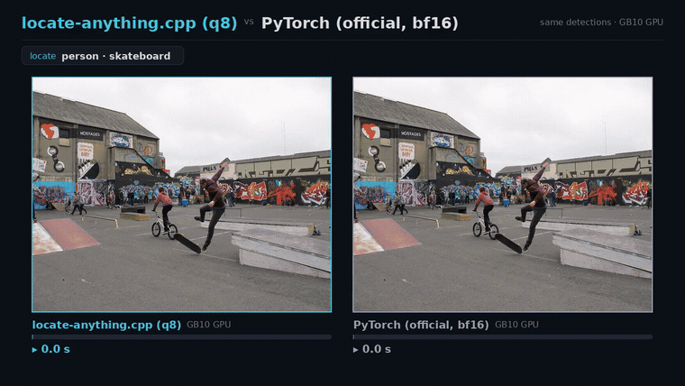

# locate-anything.cpp

**Brought to you by the [LocalAI](https://github.com/mudler/LocalAI) team**, the folks behind LocalAI, the open-source AI engine that runs any model (LLMs, vision, voice, image, video) on any hardware, no GPU required.

[](https://huggingface.co/mudler/locate-anything.cpp-gguf)
[](LICENSE)
[](https://github.com/mudler/LocalAI)

locate-anything.cpp is a C++17 inference port of NVIDIA's [`LocateAnything-3B`](https://huggingface.co/nvidia/LocateAnything-3B) - an open-vocabulary detection / visual-grounding VLM - built on [ggml](https://github.com/ggml-org/ggml). It gives you fast, dependency-light object detection from a text prompt on CPU (and on GPU through ggml's backends), with no Python runtime at inference time.

The model is Qwen2.5-3B (LM) + MoonViT (vision) + a 2-layer MLP projector; detection happens in *token space* - the model emits coordinate tokens `<0>`..`<1000>` that decode to boxes. The full pixel→labeled-boxes pipeline is ported and **validated against the official implementation**: the boxes come out identical, just faster (details and methodology in [`benchmarks/BENCHMARK.md`](benchmarks/BENCHMARK.md)).

Same detections as the official `LocateAnything-3B`, faster - here on an NVIDIA GB10 GPU,
against the official model run exactly as its model card documents (bf16), across three
scenes:

<p align="center">
  
</p>

<sub>It also runs on CPU with no GPU at all (~1.7-3× over PyTorch-CPU; see <a href="benchmarks/BENCHMARK.md">benchmarks</a>).</sub>

## What it does

Give it an image and an open-vocabulary prompt; it returns labeled boxes.

<p align="center">
  
</p>

```sh
locate-anything-cli detect --model models/locate-anything-q8_0.gguf \
    --input street.jpg \
    --prompt "Locate all the instances that matches the following description: person</c>car." \
    --annotated out.png
# -> {"detections":[{"label":"person","box":[...]}, ...]}  + an annotated PNG
```

## Performance

Identical detections to the official `LocateAnything-3B`, faster on CPU with no Python.
On a Ryzen 9 9950X3D (CPU, 16 threads), inference-only on the 448 fixture:

| mode | PyTorch (official, f32) | locate-anything.cpp (f32) | speedup | detections |
| ---- | --- | --- | --- | --- |
| slow (pure AR) | 23.65 s | 14.26 s | **1.66×** | identical (IoU 1.000) |
| hybrid (default) | 69.06 s | 22.32 s | **3.09×** | identical (IoU 0.999) |
| fast (MTP-only) | 57.55 s | 19.45 s | **2.96×** | identical (IoU 1.000) |

<p align="center">
  
  
</p>

Quantized (LM matmuls only; ViT/projector/norms stay f32) it gets smaller **and** faster with the same boxes - `q8_0` (6.3 GB) runs slow-mode in **4.89 s**, about **4.8× faster than the official f32 model**, byte-identical detections.

On **GPU** (build with `-DLA_GGML_CUDA=ON`; auto-selects the device, `LA_DEVICE=` for GPU / `LA_DEVICE=cpu` to force CPU) the weights move to VRAM. Run against the official model exactly as its model card documents (**bf16**), greedily, on one NVIDIA GB10: precision-matched (our **f16** vs its bf16) **ours is ~1.7-2.1× faster**, and the recommended **q8_0** build (box-identical) is **~1.9-3.1×**. Vs the official *sampled* out-of-box run it's mixed (faster on sparse scenes, comparable on dense - sampling stops earlier there). Full tables, the f16/q8/greedy/sampling breakdown, quantization, and parity methodology are in [`benchmarks/BENCHMARK.md`](benchmarks/BENCHMARK.md).

## Build

Clone with submodules (ggml is vendored at `third_party/ggml`):

```sh
git clone --recursive https://github.com/mudler/locate-anything.cpp
cd locate-anything.cpp
cmake -B build -DLA_BUILD_TESTS=ON -DLA_BUILD_CLI=ON && cmake --build build -j
```

### CMake options

| Option | Default | Purpose |
| ------ | ------- | ------- |
| `LA_BUILD_TESTS` | OFF | Compile and register the ctest targets |
| `LA_BUILD_CLI`   | ON  | Build `locate-anything-cli` |
| `LA_SHARED`      | OFF | Build `liblocate_anything` as a shared library (ggml static-linked in, no external libggml) |
| `LA_GGML_CUDA`   | OFF | Forward `GGML_CUDA` to the submodule |
| `LA_GGML_METAL`  | OFF | Forward `GGML_METAL` to the submodule |
| `LA_GGML_VULKAN` | OFF | Forward `GGML_VULKAN` to the submodule |

## Models

Prebuilt GGUFs are published on Hugging Face at
[`mudler/locate-anything.cpp-gguf`](https://huggingface.co/mudler/locate-anything.cpp-gguf)
(all derived from [`nvidia/LocateAnything-3B`](https://huggingface.co/nvidia/LocateAnything-3B);
only the Qwen2 LM matmuls are quantized, the vision tower + projector stay f32):

| File | Bits (LM) | Size | Notes |
| ---- | --------- | ---- | ----- |
| [`locate-anything-f16.gguf`](https://huggingface.co/mudler/locate-anything.cpp-gguf/blob/main/locate-anything-f16.gguf)  | f16  | ~9.2 GB | LM matmuls in f16, everything else f32 |
| [`locate-anything-q8_0.gguf`](https://huggingface.co/mudler/locate-anything.cpp-gguf/blob/main/locate-anything-q8_0.gguf) | q8_0 | ~6.3 GB | near-lossless, **box-identical** to f32 - **recommended** |
| [`locate-anything-q6_k.gguf`](https://huggingface.co/mudler/locate-anything.cpp-gguf/blob/main/locate-anything-q6_k.gguf) | q6_k | ~5.5 GB | box-identical to f32 |
| [`locate-anything-q5_k.gguf`](https://huggingface.co/mudler/locate-anything.cpp-gguf/blob/main/locate-anything-q5_k.gguf) | q5_k | ~5.1 GB | sub-pixel box drift |
| [`locate-anything-q4_k.gguf`](https://huggingface.co/mudler/locate-anything.cpp-gguf/blob/main/locate-anything-q4_k.gguf) | q4_k | ~4.7 GB | smallest, sub-pixel box drift |

The full-precision f32 GGUF (~15 GB) is reproducible from the HF weights with the converter
below. Quantization tradeoffs are in [`benchmarks/BENCHMARK.md`](benchmarks/BENCHMARK.md).

## Get the model

Convert the HF checkpoint to a single self-contained GGUF (needs the Python deps in
`scripts/requirements.txt`; not needed at inference time):

```sh
python scripts/download_model.py
python scripts/convert_locateanything_to_gguf.py     # -> models/locate-anything-f32.gguf
```

Then quantize (the Python `gguf` writer can't emit K-quants, so use the CLI):

```sh
locate-anything-cli quantize models/locate-anything-f32.gguf models/locate-anything-q8_0.gguf q8_0
```

Supported types: `f16`, `q8_0`, `q6_k`, `q5_k`, `q4_k`. Only the Qwen2 LM matmuls are
quantized; the ViT, projector, norms, biases, and the two host-read f32 tensors
(`lm.tok_embd`, `vit.pos_emb`) stay f32. `q8_0` is box-identical; `q4_k` is sub-pixel.

## CLI

```sh
locate-anything-cli detect --model <gguf> --input <image> --prompt <text> \
    [--mode hybrid|slow|fast] [--annotated out.png] [--output boxes.json] [--threads N]
locate-anything-cli info     --model <gguf>
locate-anything-cli quantize <in.gguf> <out.gguf> <q8_0|q6_k|q5_k|q4_k|f16>
```

Decode modes mirror the upstream `generation_mode`: `hybrid` (Parallel Box Decoding with
AR fallback, default), `slow` (pure auto-regressive), `fast` (MTP-only, no AR fallback).
The prompt is open-vocabulary; separate multiple categories with `</c>`.

## Library / C-API

The C++ `la::Engine` (`src/engine.hpp`) and a flat C ABI (`include/la_capi.h`:
`la_capi_load` / `la_capi_locate_path` / detection accessors / `la_capi_last_error` / ...)
are both built into `liblocate_anything`. Build it as a self-contained shared library
(ggml static-linked in, no external `libggml`) with `-DLA_SHARED=ON` - the loadable form
for a LocalAI backend or any `dlopen` consumer.

## Verification

Two independent checks, both runnable here:

- **Frozen-dump gates** (`tests/`, via `ctest`): tensor-by-tensor (ViT/projector/LM),
  exact token streams (slow / hybrid / fast), and final boxes, gated against references
  captured from the official model.
- **Live differential** (`scripts/diff_upstream.py`): loads the official model live and
  compares it to the CLI on unseen images/prompts/modes by box IoU. Every real detection
  matches the official model.

## Scope & limitations

This port targets the **validated single-image open-vocabulary detection** path. Two
capabilities present in the upstream remote code are **intentionally not implemented**,
because they are inherited generic-VLM scaffolding (Qwen-VL / InternVL lineage) rather than
part of the detection use case the model is trained and evaluated for:

- **Stochastic sampling** (`temperature>0`, `top_p`, `top_k`, `repetition_penalty`).
  Detection uses greedy decoding; sampling only randomizes coordinate tokens and degrades
  boxes. The engine is greedy-only by design.
- **Multi-image prompts.** Upstream concatenates all images' vision tokens into one flat
  sequence, but the output carries no image-id, so boxes can't be unambiguously attributed
  back to a specific image when images differ in size. The engine is single-image by design.

Both are deterministic to add if a concrete detection use case needs them (the projector
and token-splice already generalize to concatenated multi-image features), but neither has
a well-defined, parity-checkable detection semantics today.

## Citation

If you use locate-anything.cpp, please cite this repository and the original model:

```bibtex
@software{locate_anything_cpp,
  title  = {locate-anything.cpp: a C++/ggml inference engine for NVIDIA LocateAnything-3B},
  author = {Di Giacinto, Ettore and Palethorpe, Richard},
  url    = {https://github.com/mudler/locate-anything.cpp},
  year   = {2026}
}
```

The LocateAnything-3B model is by NVIDIA ([nvidia/LocateAnything-3B](https://huggingface.co/nvidia/LocateAnything-3B)).

## Authors

Ettore Di Giacinto ([@mudler](https://github.com/mudler)) and Richard Palethorpe.

## License

MIT (this port). The model weights are NVIDIA's under their own license; see the
[model card](https://huggingface.co/nvidia/LocateAnything-3B).
