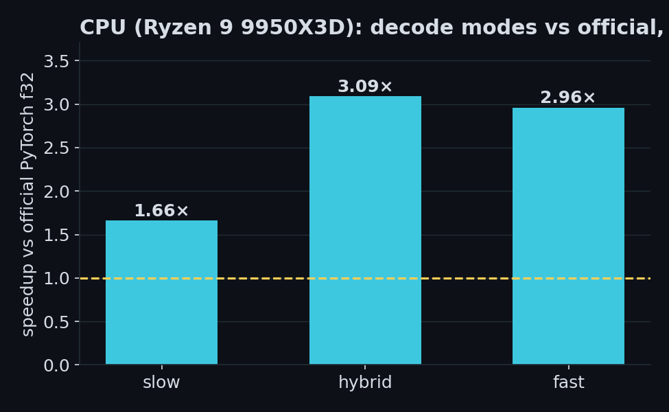
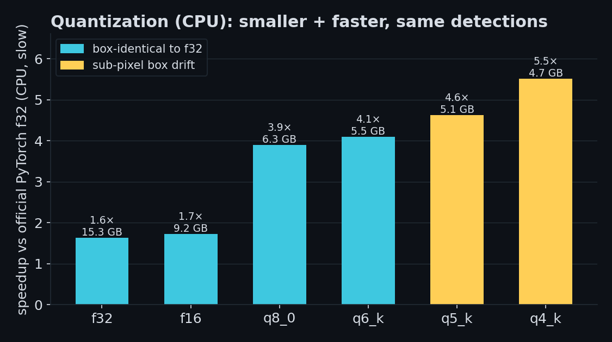
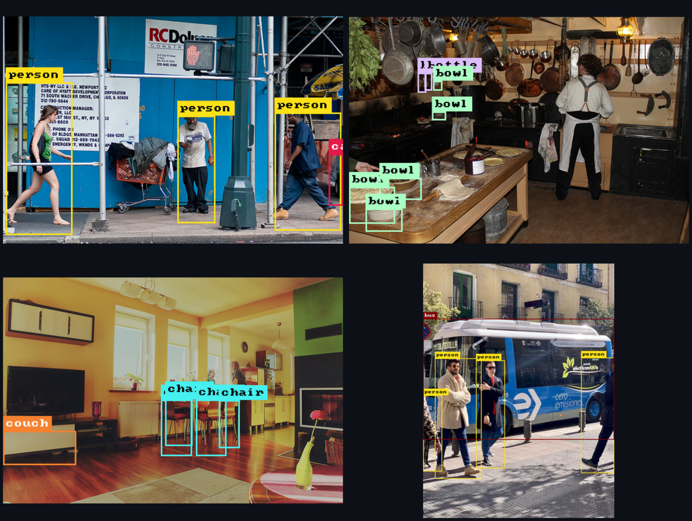
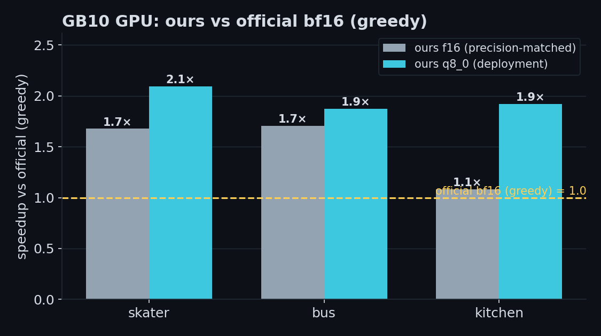
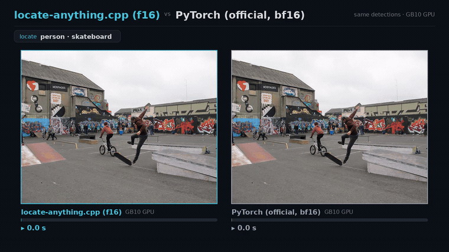

# Benchmarks — locate-anything.cpp vs the official implementation

locate-anything.cpp produces the **same detections** as NVIDIA's official
`LocateAnything-3B` PyTorch/transformers implementation, and gets them **faster on
CPU** with no Python at inference time. The boxes are not "close" — on the validated
single-image detection path the real detections match the official model bit-for-bit
(see [parity](#parity), and `scripts/diff_upstream.py` for the live cross-check).

  

## Setup

| | |
| --- | --- |
| CPU | AMD Ryzen 9 9950X3D (16 cores) |
| RAM | 84 GB |
| Threads | 16 (both engines) |
| Backend | ggml CPU (no GPU) |
| Reference | `nvidia/LocateAnything-3B` via transformers, f32, the loyal `magi`→`sdpa` path |
| Image / prompt | the 448×448 fixture, "Locate all the instances that matches the following description: cat\</c>remote." |
| Decoding | greedy (`temperature=0`), `max_new_tokens=256` |

**Timing is inference-only on both sides, model load excluded:**
- upstream: wall time of `model.generate(...)` with the model already resident.
- locate-anything.cpp: `t(detect) − t(info)`, where the `info` subcommand loads the
  same GGUF and exits — subtracting it removes the one-time model-load / page-cache
  cost and leaves the decode. Both are measured warm.

Reproduce with `python -m benchmarks.bench --threads 16` (writes `results.json`).

## Speed vs official PyTorch (f32, same precision)

Inference seconds on the fixture, and the detections each engine produced:

| mode | PyTorch (official) | locate-anything.cpp | speedup | detections (IoU vs official) |
| ---- | ------------------ | ------------------- | ------- | ---------------------------- |
| slow (pure AR)        | 23.65 s | 14.26 s | **1.66×** | 4/4 match, IoU 1.000 |
| hybrid (PBD, default) | 69.06 s | 22.32 s | **3.09×** | 42/42 match, IoU 0.999 |
| fast (MTP-only)       | 57.55 s | 19.45 s | **2.96×** | 42/42 match, IoU 1.000 |

The hybrid/fast modes emit 42 boxes here: 4 real detections (cat, cat, remote, remote)
plus a degenerate repeated-box tail — an artifact of decoding to the length cap with no
objects left. The official model emits the same tail; the real detections are identical.

## Quantization (our side) — smaller and faster, same boxes

Only the Qwen2 LM matmuls are quantized; the ViT, projector, norms and the two
host-read f32 tensors stay f32. Slow-mode inference on the fixture (median of 2 runs;
parity is vs our own f32 output, which is byte-identical to the official model). The
`vs official` column divides the official PyTorch f32 slow time (23.65 s) by each:

| dtype | size | infer | speedup vs f32 | vs official PyTorch | boxes |
| ----- | ---- | ----- | -------------- | ------------------- | ----- |
| f32   | 15.33 GB | 14.49 s | 1.00× | 1.6× | 4/4, IoU 1.000 |
| f16   | 9.15 GB  | 13.68 s | 1.06× | 1.7× | 4/4, IoU 1.000 (identical) |
| q8_0  | 6.26 GB  | 6.07 s  | 2.39× | **3.9×** | 4/4, IoU 1.000 (identical) |
| q6_k  | 5.51 GB  | 5.77 s  | 2.51× | **4.1×** | 4/4, IoU 1.000 (identical) |
| q5_k  | 5.10 GB  | 5.11 s  | 2.84× | **4.6×** | 4/4, IoU 0.982, ≤0.5 px |
| q4_k  | 4.72 GB  | 4.29 s  | 3.38× | **5.5×** | 4/4, IoU 0.982, ≤0.5 px |

Two takeaways:

- **Quantization, not the engine, is the bigger lever.** The LM decode is memory-bandwidth
  bound, so the K-quants (q8_0…q4_k) run 2.4–3.4× faster than f32 — q8_0/q6_k with
  **byte-identical boxes**, q5_k/q4_k with sub-pixel drift. **q8_0 is the sweet spot**:
  less than half the size, box-identical, ~3.9× faster than the official f32 PyTorch.
- **f16 is not worth it on CPU.** It's barely faster than f32 (1.06×) — f16 matmuls don't
  beat f32 on CPU and it's still 9 GB — while q8_0 is smaller, faster, and equally
  box-identical. Publish/run f16 only if a backend specifically wants it.

(Reproduce with `python -m benchmarks.quant_bench` → `quant_results.json`.)

## Detections

Open-vocabulary detection on unseen COCO scenes (slow mode, f32), rendered by the CLI's
`--annotated`:

  

## Parity

Two independent checks back the "same detections" claim:

- **Frozen-dump gates** (`tests/`, run by `ctest`): tensor-by-tensor (ViT/projector/LM),
  exact token streams (slow / hybrid / fast — e.g. 258/258 ids), and final boxes, all
  gated against references captured from the official model.
- **Live differential** (`scripts/diff_upstream.py`): loads the official model live and
  compares it to the CLI on a sweep of unseen images/prompts/modes by box IoU + label.
  Across the sweep, every real detection matched the official model (slow mode to ≤0.9 px;
  2 of 3 hybrid cases bit-exact). Only the meaningless degenerate tail can diverge.

## GPU (NVIDIA GB10 / Grace-Blackwell) — vs the official model run as documented

Built with `-DLA_GGML_CUDA=ON` (CUDA 13). The engine auto-selects the GPU and offloads the
weights to VRAM (the two host-read f32 tensors stay on CPU; ops without a CUDA kernel fall
back via `ggml_backend_sched`). Run with `LA_DEVICE=` (auto-GPU) / `LA_DEVICE=cpu`.

Two axes are held fixed so the comparison is apples-to-apples:

- **Decode strategy** — *both* sides use `generation_mode=hybrid`, **greedy**. Our engine is
  greedy-only by design; the official is run with `do_sample=False` to match. (The model
  card's own out-of-box config samples — that's the separate last column, below.)
- **Precision** — our **f16** is matched to the official **bf16** (both 16-bit). q8_0 is the
  lower-precision deployment quant, shown alongside.

Everything else follows the [model card](https://huggingface.co/nvidia/LocateAnything-3B)
verbatim (`torch.bfloat16`, `py_apply_chat_template`/`process_vision_info`, the documented
`generate` call); ours runs with the hybrid early-stop. One idle GB10, warm (warm-up +
median of 3), `benchmarks/demo/dgx_official.py`.

The first three columns are the **greedy** head-to-head (same decode); the last is the
official's documented **sampling** config (`temperature=0.7, top_p=0.9, repetition_penalty=1.1,
max_new_tokens=2048`) — a *different* decode, shown for the literal out-of-box time:

| image | official bf16 · greedy | ours **f16** · greedy | f16 speedup | ours **q8_0** · greedy | q8 speedup | official bf16 · **sampling** |
| ----- | ---------------------- | --------------------- | ----------- | ---------------------- | ---------- | ---------------------------- |
| coco_skater  | 2.53 s | 1.51 s | **1.7×** | 1.21 s | **2.1×** | 2.08 s |
| bus          | 4.78 s | 2.80 s | **1.7×** | 2.56 s | **1.9×** | 2.00 s |
| coco_kitchen | 2.73 s | 2.52 s | 1.1×     | 1.42 s | **1.9×** | 1.01 s |

The precision-matched race — our **f16** vs the official **bf16**, greedy, on the GB10 GPU
(the [README](../README.md) hero is the same race with the q8_0 deployment build):

Honest reads:

- **Greedy, precision-matched (our f16 vs the official bf16): ours is ~1.1–1.7× faster** on
  the GB10 GPU. The recommended **q8_0** build (box-identical to f16, see the quant table) is
  faster still — ~1.9–2.1× — by halving the LM weight bandwidth. The only asymmetry in the
  greedy columns is that ours has the early-stop and the official greedy runs to the cap.
- The kitchen f16 row is the weak one (1.1×): the early-stop is a heuristic on the
  numerically-unstable degenerate tail and didn't trigger for f16 there, so it ran long.
- **vs the official *sampled* out-of-box run it's mixed**: faster on sparse scenes (skater),
  slower on dense ones (bus/kitchen), because the official sampling emits `im_end` and stops
  earlier there. Greedy decoding (ours and the model's own greedy) is inherently more verbose.

Box parity holds where it should (e.g. bus 7/7 within ~6 px, bf16-vs-q8 rounding); on dense
scenes the per-image counts differ only in the degenerate tail.

## Caveats / honesty

- Single warm run per cell (run-to-run variance is ~5%; e.g. f32-slow measured 13.56 s and
  14.26 s in two passes). The harness reports a median if you pass `n>1`.
- PyTorch uses its default intra-op thread count (≈ the 16 physical cores); ours is pinned
  to `--threads 16`. Both are effectively CPU-saturated.
- The top CPU-vs-PyTorch table is on a Ryzen 9 9950X3D; the GPU table is the GB10 run (both
  engines, same box). Different hardware, so compare within a table.
- The CPU tables compare against upstream in **f32, greedy**; the GPU table uses the official
  **bf16** config (the model card specifies bf16+cuda, so there is no documented CPU config).
  The official's bf16 weights run on CPU too but bf16 has no CPU acceleration, so a CPU bf16
  baseline would be *slower* for upstream — the f32 CPU numbers are the conservative choice.
- The GPU box must be idle: any other GPU tenant (e.g. a running model server) has to be
  stopped first, or the numbers are contended.
- These are the validated single-image detection times; sampling and multi-image are out
  of scope (see the README "Scope & limitations").
